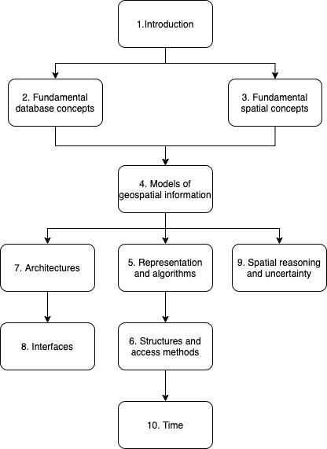

## What is GIS?

A computed-based `information system` that enables capture, modeling, storage, retrieval, sharing, manipulation, and presentation of `geospatial data`

- context: the structure of `interrelationships between data`and how data is collected, processed, used, and understood within an application
- data is only useful within its context
  `information = data + context`

## GIS functionality

- resource inventory
- field-based analysis: variations of attributes over a region
- network analysis:
- distributed data
- terrain analysis
  - visibility Analysis
- layer-based analysis
- location analysis
- spatiotemporal information

## Data and databases

- data is measured in `bits`
- each bit records one of two possible states(0 or 1)
- `Bits` are merged into `bytes`
- each byte represents a single character
- each byte allows for 2^7=127 possible character combinations
- spatial data is traditionally divided into two great classes:
  - `raster`: ara array of grid of cells, referred to as pixels
    - pros: easy to handle,able to represent a large range of computable spatial objects
    - cons: inefficient in storing
  - `vector`: a finite straight line segment defined by its end points
    - pros: efficient in storing
    - cons: hard to analysis
- Database: a repository of data, the process of `developing a database` is a process of `model building`
  - application domain model: describes the `core requirements` of users in a particular application domain
  - conceptual model: tailored to a particular type of implementation
  - physical computational model: the result of a process of programming and system implementation
- spatial data retrieval and Analysis
  - `spatial data` is notoriously `large` and often `hierarchically`
  - geospatial data is often embedded in the Euclidean plane-> `spatial storage structures` + `access methods`
  - `Map-based presentation` is a distinctive feature of a GIS
- Distributed database: `multiple databases connected by a digital communication network`.
  - Increased reliability
  - improved performance

## Hardware support

- input
- control
- storage
- processing
- digital networks: most communication networks are digital(0,1)
- analog network: for old data communication, signal strength can vary continuously like a sine wave
- Electromagnetic radiation
  - frequency
  - wavelength
  - `higher` bandwidth means `greater data transmission capacity`
  - High-frequency ultraviolet, X-rays, and gamma rays are not used for data transmission
