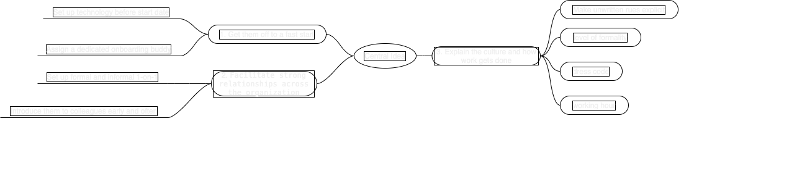

## Tip

Whenever you’re onboarding a new employee, the goal is to help them feel at home and excited about the work ahead. But when their interactions with you and the rest of the team are only virtual, how do you do that? Here are some tips.

1. `Get them off to a fast start`. This means having their technology set up before their start date, and making sure they know who to go to with questions from day one. Assign them a dedicated onboarding buddy who can be their go-to person with the many spontaneous questions they’re likely to have.

2. `Facilitate strong relationships across the organization`. Since you can’t rely on the organic and spontaneous relationship-building that happens in the office, be proactive and intentional about setting up a mix of formal and informal one-on-one interactions between the new hire and other individuals. Don’t forget to introduce them to colleagues across departments early and often.

3. `Explain the culture and how work gets done`. Make unwritten rules explicit, such as your company’s level of formality, dress code, virtual etiquette on videoconferences, communication norms, and working hours. It will be far less stressful if your new employee doesn’t have to guess at these issues.

## Translations

   
🇨🇳用正确的方式帮助远程新员工入职

无论何时，当你帮助一位远程新员工入职时，你的目标就是让他们感到宾至如归，并对即将到来的工作感到兴奋。但是当他们与你和团队的其他成员的互动只是虚拟的，你该怎么办? 以下是一些提示。

1. 让他们迅速上手。这就是说，在他们开始工作之前，就帮他们准备好要使用的技术，并确保他们从第一天起应该问谁。给他们指定一个专门入职伙伴，可以帮他们解决许多可能会遇到的问题。
2. 促进整个组织建立牢固的关系。由于你不能依靠在办公室中自然而自然地建立关系。所以要积极主动，有意识地在新员工和其他人之间建立正式和非正式的一对一交流。别忘了要尽早并经常向其他部门的同事介绍他们。
3. 解释文化和工作方式。 明确不成文的规定，如公司的礼节、着装规范、视频会议中的虚拟礼仪、沟通规范和工作时间。如果你的新员工不需要猜测这些问题，压力就会小得多。

## Mindmap

